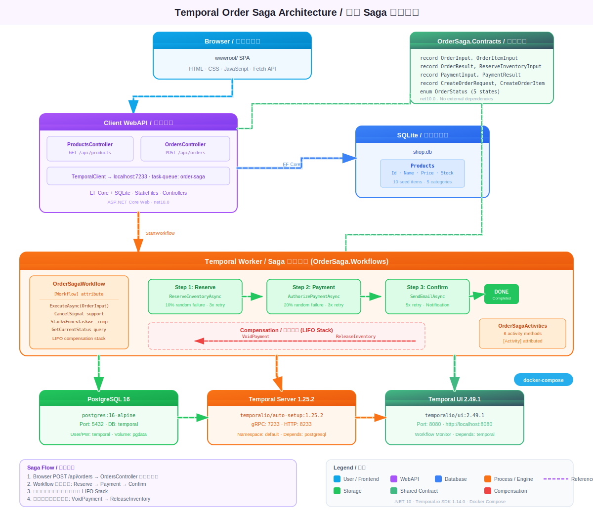

# Temporal Order Saga

基于 Temporal.io 的订单 Saga 补偿事务模式实现，使用 .NET 10 + Temporalio SDK。

## 架构图



## 技术栈

- **.NET 10** + Temporalio SDK 1.14.0
- **Temporal Server** 1.25.2 (docker-compose)
- **PostgreSQL 16** (持久化存储)

## 项目结构

| 项目 | 说明 |
|------|------|
| `OrderSaga.Contracts` | 共享消息类型：OrderInput, OrderResult, PaymentInput, OrderStatus 等 |
| `OrderSaga.Workflows` | Temporal Workflow + Activity + ASP.NET Core Worker 宿主 |
| `Client` | 控制台客户端，启动工作流并等待结果 |

## Saga 流程

```
1. ReserveInventory  ─── 成功则注册补偿: ReleaseInventory
       │
2. AuthorizePayment  ─── 成功则注册补偿: VoidPayment
       │
3. SendConfirmationEmail
       │
4. CompleteOrder
```

任一步骤失败，按 LIFO 顺序执行已注册的补偿操作。

## 快速开始

```bash
# 1. 启动 Temporal 基础设施
docker-compose up -d

# 2. 等待服务就绪后启动 Worker
dotnet run --project OrderSaga.Workflows

# 3. 另开终端，运行客户端启动订单工作流
dotnet run --project Client
```

- Temporal gRPC: `localhost:7233`
- Temporal UI: http://localhost:8080

## 前置条件

- .NET 10 SDK
- Docker & Docker Compose
